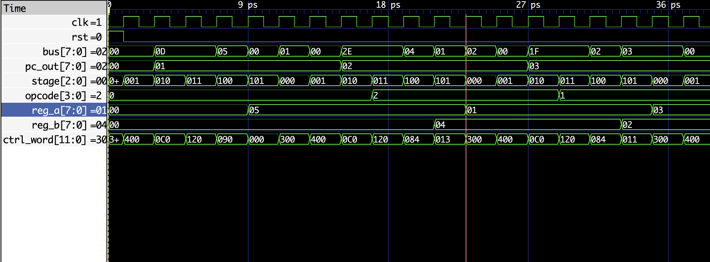

# An 8-bit computer implemented in FPGA

This is an 8-bit computer implemented using Verilog

This computer can perform addition and subtraction on integers

We can program this computer using the [program.bin](program.bin) file

Simulation (done with [GTKWave](https://gtkwave.sourceforge.net/)):

> Note: Check the [example_program.md](docs/example_program.md) to learn how to program this computer
