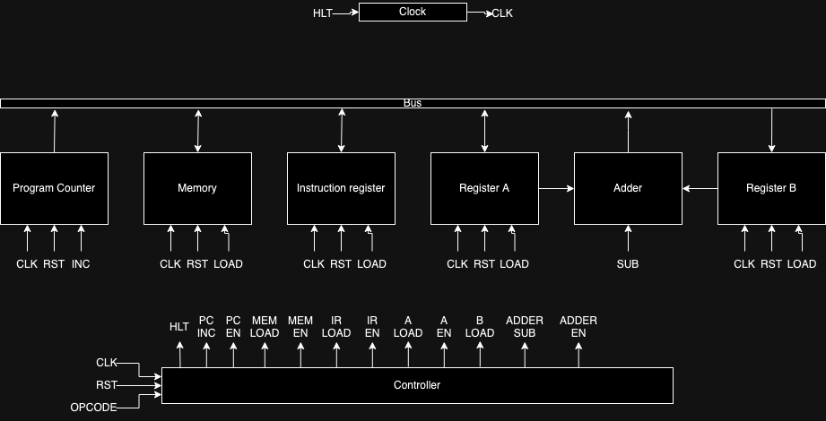

# Documentation

## Clock

This module synchonizes all the components.

It outputs the input *clk_in* if *hlt* is low, else it will output a 0. The *hlt* signal will be used to implement the **HLT** instruction to halt computer execution.

## Bus

This is where all the data is sent through. It is 8-bit.

In order to select which module's data will be placed on the bus at a certain moment, we can use enable signals to multiplex between the different modules output. 

The controller will control these enable signals.

## Program Counter

This module stores the address of the next instruction to be executed. 

Since this computer only has 16 bytes of memory, the program file can only have 16 different bytes (`0x0` to `0xF`). Each bytes are an instruction to be executed.

This module accepts an *inc* signal, which tells it to increment the value in itself by 1, else it stays the same.

## Instruction register

This module loads the instruction from memory and seperates the opcode and the data.

The upper 4 bits are the opcode and the lower 4 bits are the address of the value to be operated on.

The instructions that don't need the lower 4 bits (like **HLT**) will ignore those bits

## Registers

Registers are a type of computer memory. They may be used to store and manipulate data during the execution of instructions.

### A register

This is the main register of this computer.

It needs a *load* signal to load values into it from the bus.

### B register

This is the same as the A register, designed to support the A register.

## Adder

This module is responsible for doing all the math (which is adding and subtracting). This module works directly with the A and B register to calculate.

It can add (A + B) or subtract (A - B).

This doesn't use a clock signal as it is constantly calculating based on the values in A and B and outputing the result

## Memory

This computer has 16 bytes of memory.

The memory has a 4-bit register called the *Memory Address Register* (MAR) used to temporarily store a memory address. 

This computer takes 2 clock cycles to read from the memory:
- 1st cycle: Load an address from the bus into the MAR (*load* signal)
- 2nd cycle: Use value in MAR to address into RAM and output the value

> This computer initializes the memory by loading from a file (program.bin)

## Controller

This decides what the computer will do by sending different signals that control the modules.

Control signals:
| Name | Description |
| ------ | ----------- |
| *hlt* | halt execution |
| *pc_inc* | increment program counter |
| *pc_en* | put value of the pc onto the bus |
| *mar_load* | load address into memory address register |
| *mem_en* | put value from memory into the bus |
| *ir_load* | load value from bus into intruction register |
| *ir_en* | put value in ir onto the bus |
| *a_load* | load value from bus into A register |
| *a_en* | put value in A onto the bus |
| *b_load* | load value from bus into B register |
| *adder_sub* | subtract value in B from A |
| *adder_en* | put value in adder onto the bus |

Refer to [execution.md](execution.md) for how the computer execute the instruction

## Programming

We can program this computer by programming the bytes directly.

In the binary file, we can specify the instruction we want to use with the first 4 bits and the location of the operands in the last 4 bits.

For the **HLT** instruction, since it doesn't use any operand, we can just put 0 in the last 4 bits.

The `program.bin` file must have 16 bytes so if your program doesn't utilize all 16 bytes then fill out the rest of the file with 0s.

And example program can be found in [example_program_annotated.md](example_program_annotated.md) and [program.bin](../program.bin)
